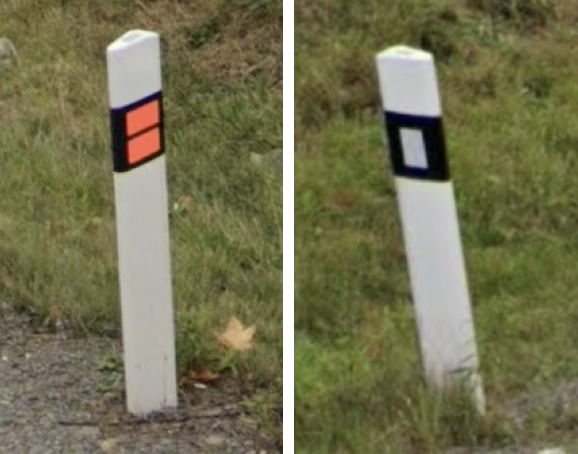
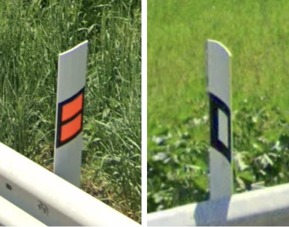
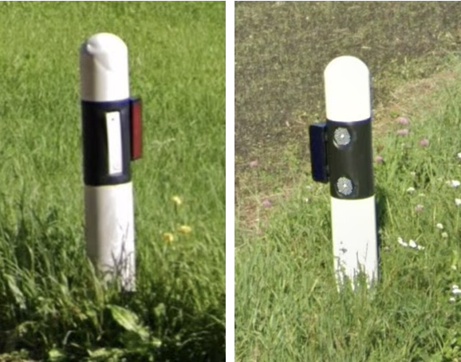
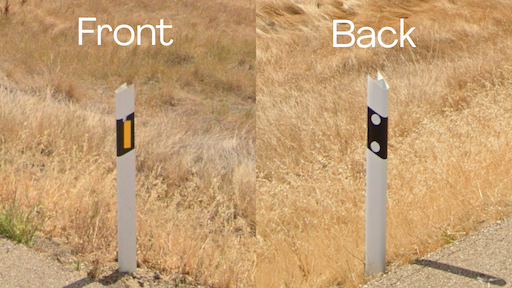
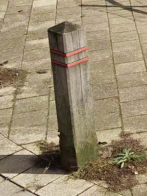
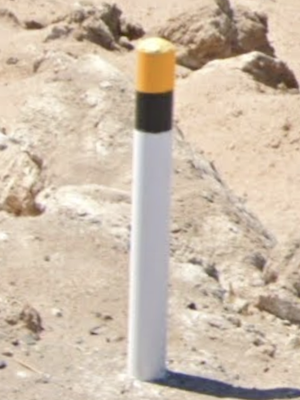
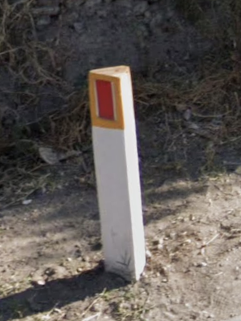

# Bollard

## French style

{}

#### France, Senegal



<--->

#### Scotland (UK)



<--->

#### France



<--->

{}

## Czech, Slovakia: double reflectors

{}

#### Wedge

<--->

#### Curved

<--->

{}

## White wedge with reflector

{}

#### Belgium



<--->

#### Denmark



<--->

#### Cyprus


<--->

{}

## Rounded top, cylindrical, black and white

Switzerland, Liechtenstein

## Spanish style: orange and white

{}

#### Spain

<--->

#### Chile

{}

## Wedge, retangular reflector

{}

#### Andorra, Canary Islands, Spain



<--->

#### Greece



{}

## Two red stripes: Netherland, Belgium

## South East Asia style

{}

#### Red and White



<--->

#### Black and White



<--->

#### Sri Lanka



{}

## Concrete

{}

#### Mexico



<--->

#### Moquegua (Peru)

<--->

#### Peru

<--->

{}

## Misc

{}

#### Mongolia



<--->

#### Iceland



<--->
<--->

{}
