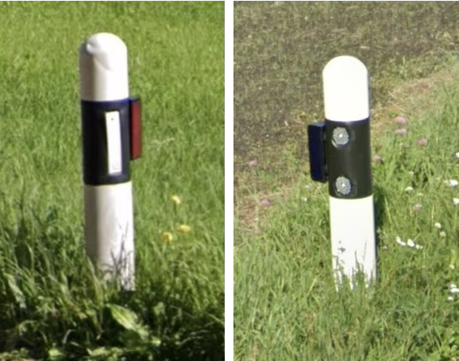

# Bollard

## French Style

{}

### France, Senegal



<--->

### Scotland (UK)



<--->

### France



<--->

{}

## Czech, Slovakia: Double Reflectors

{}

### Wedge

<--->

### Curved

<--->

{}

## Wedge, Yellow and White

{}

### Belgium

<--->

### Denmark

<--->
<--->

{}

## Rounded top, Cylindrical, Black and White

Switzerland, Liechtenstein

## Spanish Style: Orange and White

{}

### Spain

<--->

### Chile

{}

## Wedge, Retangular Reflector

{}

### Andorra, Canary Islands, Spain



<--->

### Greece



{}

## Two red stripes: Netherland, Belgium

## South East Asia Style

{}

### Red and White



<--->

### Black and White



<--->

### Sri Lanka



{}

## Concrete

{}

### Mexico



<--->

### Moquegua (Peru)

<--->

### Peru

<--->

{}

## Misc

{}

### Mongolia



<--->

### Iceland



<--->
<--->

{}

