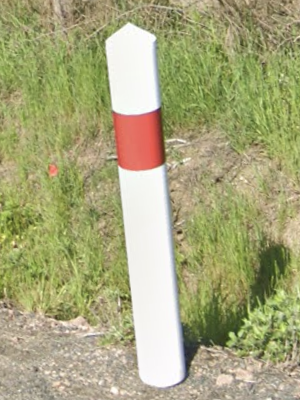
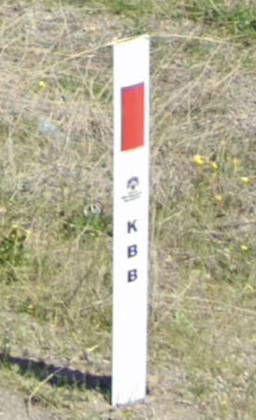

# Bollard

## French Style: Pointy Top, Red or Grey

France, Senegal

## Czech, Slovakia: Double Reflectors

{}

### Wedge

<--->

### Curved

<--->

{}

## Wedge, Yellow and White

{}

### Belgium

<--->

### Denmark

<--->
<--->

{}

## Rounded top, Cylindrical, Black and White

Switzerland, Liechtenstein

## Spainish Style: Orange and White

{}

### Spain

<--->

### Chile

{}

### Andorra, Canary Islands, Spain

## Red and White

{}

### Poland

<--->

### New Zealand

{}

{}

### Australia

<--->

### Turkey

<--->

### Romania

<--->

### Netherland

{}

## Mongolia: Bowling

## Iceland

## Mexico

