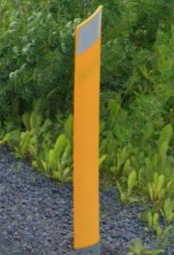
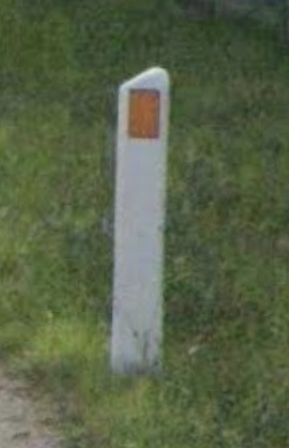
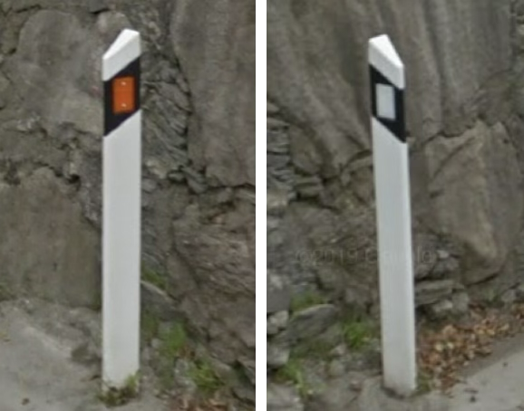

# Bollard

## Pointy Top, red or grey reflector

### French Style: France, Senegal

## Double Reflectors

### Czech, Slovakia
Tilted, Red/Orange reflectors

### Italy

## Yellow Wedge

### Iceland

## Wedge, Yellow and White

### Belgium

### Denmark
With orange stripe

## Wedge, Black and White

### German style: Germany, Luxembourg, Switzerland, Sweden, Portugal

### Luxembourg: Three bolts

## Cylindrical, Black and White

### Rounded top: Switzerland, Austria, Liechtenstein

### Flat top: Estonia, Latvia, Sweden, Finland, Norway

### Nordic Baltic Summary

## Black, Red and White

### Front red, Back white: Russia, Ukraine,, Bulgaria, Croatia, Montenegro, North Macedonia, Serbia, Slovakia, Hungary, Greece, Lithuania

### Almost Square reflector: Greece

### Fat reflector: Ukraine, Greece

### Black top: Italy, Alabania, Malta

### Off-centered: Serbia

 

### Black top, Red reflector below: Russia, Serbia, Albania, North Macedonia

### Red reflector below, not overlapped: Montenegro, Slovenia, Serbia, North Marcedonia, Austria

## Black, Orange and White

### Spain
Orange/Yellow vertical strip, white dots at back

### Andorra, Canary Islands, Spain
Orange retangular

### Estonia
Orange or White. strip, dots on each side, baton-like shape

### Lativia
Orange or White. strip, dots on each side, curved shape

### Lithuania
Orange and White, strip on both side, wedged (similar to Russian style)

### Sweden
Orange/Yellow/White, strip, dots on each side, wedged (similar to German style)

## Red and White

### Mongolia
bowling

### Poland

### New Zealand
red strip wraps around

### Australia
red vertical strip, red dot

### Netherland

### Turkey
red vertical strip, sometimes with three alphabets

### Romania

## Snow Pole

### Norway
reflector close to middle

### Sweden
longer reflector

### Finland
reflector close to the top, only one reflector

## Misc

### Mexico

