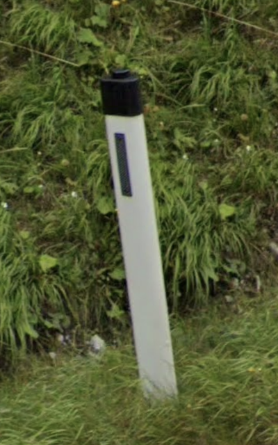

# Black Hat

Wedge, front red and back white, strip on both side, with black hat

## Standard

Austria, Slovenia, Croatia, Montenegro

## Variants

{}

### Russia

Reflector on top

<--->

### Serbia

Off-centered

<--->
<--->

{}

## Nipple-shaped: Austria, Slovenia

