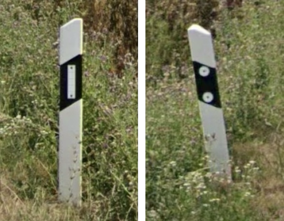
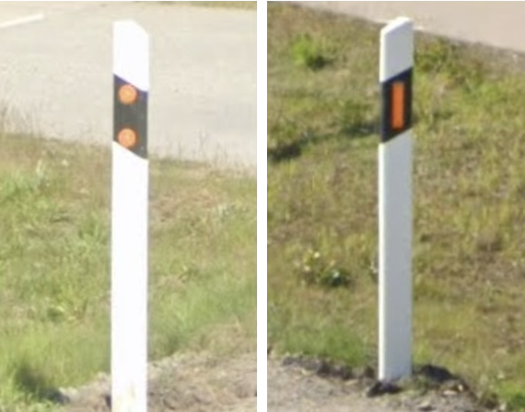
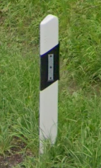

# German Style

Wedge shape, with white or orange reflector

## Standard

Germany, Luxembourg, Switzerland, Portugal, Sweden

{}

<--->

<--->

{}

## Three bolts: Luxembourg

## Lithuania

Orange and White on each side, strip on both side

