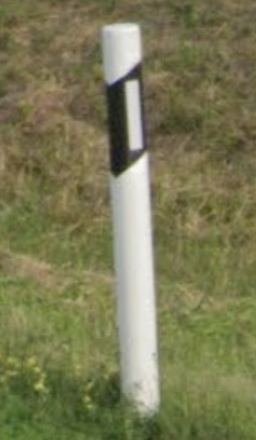
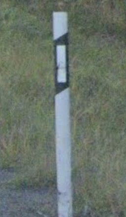
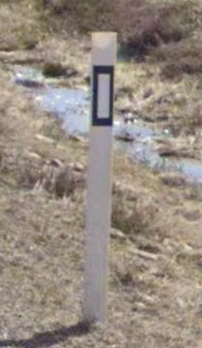
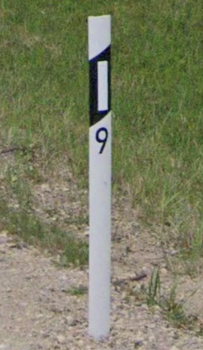
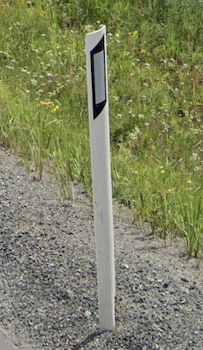
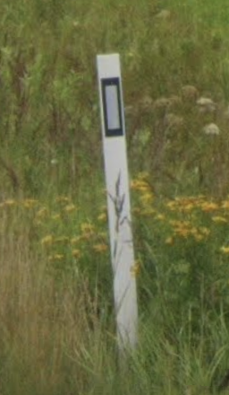

# Nordic style

Baton or curved shape, white or orange

## Baton

{}

### Estonia

White or Orange

<--->

### Finland

Always white

<--->

### Sweden

Rect. black strip

<--->

{}

## Curved

{}

### Lativia

White or Orange

<--->

### Norway

Black strip on top

<--->

### Sweden

Rect. black strip

<--->

{}

## Summary

