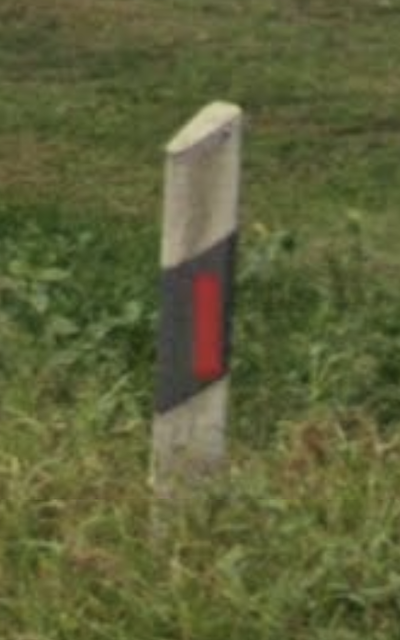
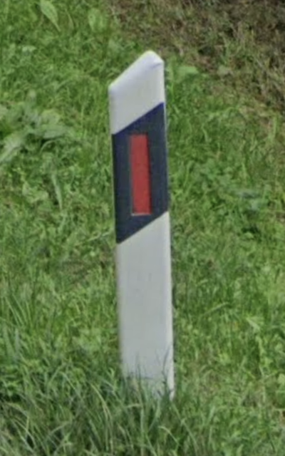
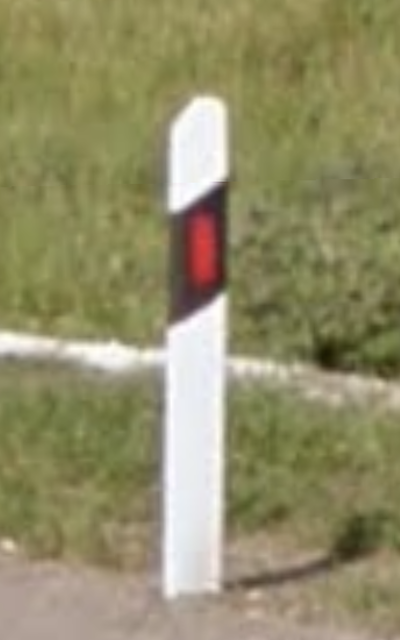
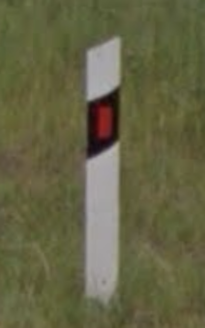
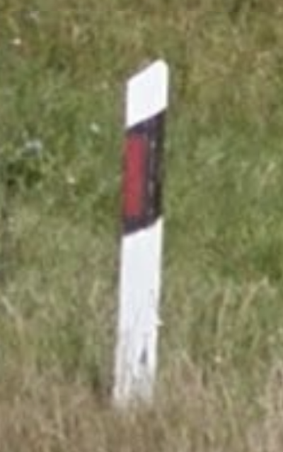
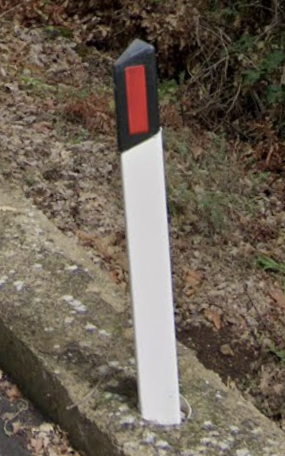
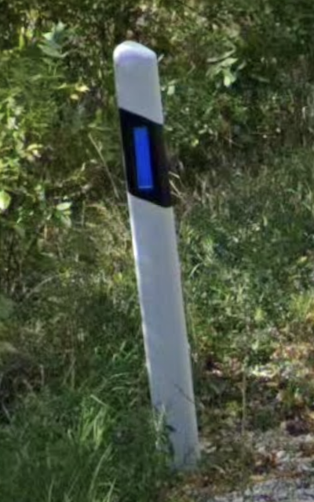
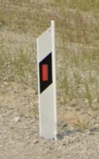
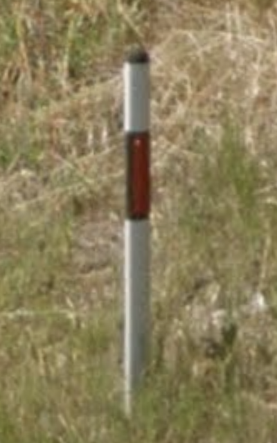

# Slavic Style

Wedge, front red and back white, strip on both side

## Standard

Russia, Ukraine, Hungary, Bulgaria, Croatia, Montenegro, North Macedonia

**Shorter white top**: Croatia, Montenegro, North Macedonia

{}

### Hungary

<--->

### Croatia

<--->

### Russia

<--->

### Ukraine

{}

## Variants

{}

### Greece

Almost Square

<--->

### Serbia

Off-centered

<--->
<--->

{}

## Black top: Italy, Albania

## Blue reflector: Hungary

## Eastern Russia

East of Omsk

## North Macedonia

