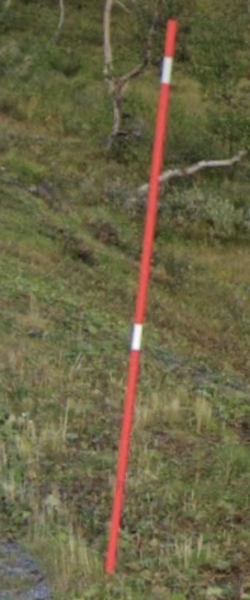
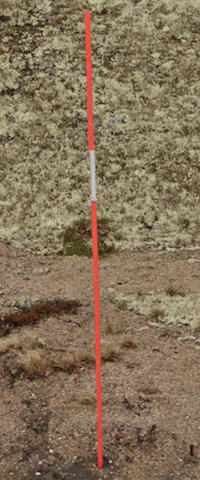
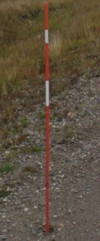
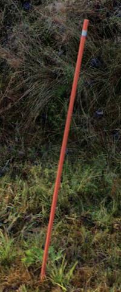

# Snow pole

## Norway

reflector close to middle

{}

<--->

<--->
<--->

{}

## Sweden

longer reflector

{}

<--->

<--->
<--->

{}

## Finland

reflector close to the top, only one reflector

