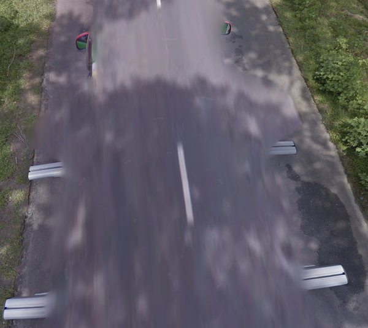

# Car meta

## Europe gen 4

[Full Doc]( https://docs.google.com/document/d/17X21eUdU_AhbiyDsEHLQCthJKjh9VuocNf7GhCvNATA/edit?usp=sharing) by Elori

| Car  | Ant. | Year | Country                              | Rare             |
|:----:|:----:|:----:|:------------------------------------ |:---------------- |
| 🟦   | ⭕️   | 2021 | Sweden, Hungary, Bulgaria            | Romania, France  |
| 🟦   | ❌   | 2020 | Ireland, Norway, Czechia             | Denmark, Hungary |
| 🟦   | ❌   | 2019 | Ireland, Norway, Czechia             | Denmark, Hungary |
| 🚫   | ❌   | 2020 | Belgium                              |                  |
| ⚫   | ⭕️   | 2024 | Bulgaria, Lithuania                  |                  |
| ⚫   | ⭕️   | 2023 | Lithuania, Czechia, Netherlands, UK  |                  |
| ⚫   | ⭕️   | 2022 | Latvia                               |                  |
| ⚫   | ❌   |      | Greece                               | Everywhere       |
| 🔴   |      |      | Sweden, Slovakia, Bulgaria           |                  |
| ⚪   |      |      | Sweden, Turkey, Luxembourg           |                  |
{.table-tight .table-car-meta}

- Austria, Belgium: No car
- Turkey: White car, No car
- Eletric car: **Frankfurt, Hamburg, London, Ireland**
- Blue car, With antenna, Mediterranean: **Italy, Croatia**. not Portugal, Spain, Greece, Turkey
- Blue car, 2023, w/ or w/o antenna: Not Slovakia
- Blue car, With antenna: 2022 -> Croatia, 2023 -> Slovenia
- Blue car, With antenna, 2023: Not Estonia, Lativia

## Europe gen 3
- With antenna: never **North Macedonia**, **Turkey**
- Winter: **Czechia, Hungary, Bulgaria**
- Side mirror with yellow sticker: **Croatia**
- Before 2019 🇭🇷 🇸🇮 🇷🇴 🇧🇬 🇷🇸 🇲🇰 🇲🇪 🇦🇱:
    |      | 🇭🇷  | 🇸🇮  | 🇷🇴  | 🇧🇬  | 🇷🇸  | 🇲🇰  | 🇲🇪  | 🇦🇱  |
    |:---- |:---:|:---:|:---:|:---:|:---:|:---:|:---:|:---:|
    | 2012 |  v  |     |     |     |     |     |     |     |
    | 2013 |  v  |  v  |  v  |  v  |     |     |     |     |
    | 2014 |  v  |  v  |  v  |     |  v  |     |     |     |
    | 2015 |     |     |     |  v  |  v  |  v  |     |     |
    | 2016 |  v  |     |     |  v  |  v  |  v  |  v  |  v  |
    | 2017 |     |  v  |  v  |  v  |  v  |  v  |     |     |
    | 2018 |     |     |     |  v  |     |     |  v  |     |
    {.table-tight .header-first}

## Europe gen 3 antenna with tape

{}

#### Czechia



<--->

#### Slovakia



<--->

#### Hungary



{}
{}

#### Romania



<--->

#### Bulgaria



<--->

#### Bulgaria



{}

> [!WARNING]
> **Warning**  
> This is the experimental meta

## Stubby antenna



## Stubby antenna with three ridges



> [!WARNING]
> **Warning**  
> This is the experimental meta

## Thin stubby antenna



## Gen 3 white car with breaklight



## Sri Lanka



## Special Car

### Black car

{}

#### Bermuda



<--->

#### Tau, Samoa



<--->

#### Providencia, Colombia



{}

### White car

{}

#### St Croix, US Virgin



<--->

#### Sir Baniyas, UAE



<--->

#### San Andrés, Colombia



{}

### Bangladesh

### General Santos City, The Phillipines

### Krugar National Park, South Africa

