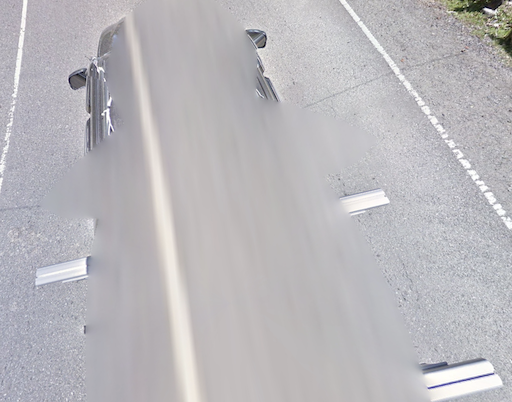

# Car meta

## Europe Gen 4

- [Full Doc]( https://docs.google.com/document/d/17X21eUdU_AhbiyDsEHLQCthJKjh9VuocNf7GhCvNATA/edit?usp=sharing)
- Blue car, With antenna, 2021: **Sweden, Hungury, Bulgaria**
- Blue car, No antenna, 2019/2020: **Ireland, Norway, Czechia**, Denmark, Hungary
- No car, No antenna, 2020: **Belgium**
- Red car: **Sweden, Slovakia, Bulgaria**
- Eletric car: **Frankfurt, Hamburg, London, Ireland**
- Austria, Belgium: No car
- Turkey: White car, No car
- Blue car, With antenna, Mediterranean: **Italy, Croatia**. not Portugal, Spain, Greece, Turkey
- White car: **Sweden, Turkey, Luxenburg**

## Europe Gen 3
- With antenna: never **North Marcedonia**, **Turkey**
- Winter: **Czechia, Hungary, Bulgaria**
- Side mirror with yellow sticker: **Croatia**
- Before 2019 🇭🇷 🇸🇮 🇷🇴 🇧🇬 🇷🇸 🇲🇰 🇲🇪 🇦🇱:
    |      | 🇭🇷  | 🇸🇮  | 🇷🇴  | 🇧🇬  | 🇷🇸  | 🇲🇰  | 🇲🇪  | 🇦🇱  |
    |:---- |:---:|:---:|:---:|:---:|:---:|:---:|:---:|:---:|
    | 2012 |  v  |     |     |     |     |     |     |     |
    | 2013 |  v  |  v  |  v  |  v  |     |     |     |     |
    | 2014 |  v  |  v  |  v  |     |  v  |     |     |     |
    | 2015 |     |     |     |  v  |  v  |  v  |     |     |
    | 2016 |  v  |     |     |  v  |  v  |  v  |  v  |  v  |
    | 2017 |     |  v  |  v  |  v  |  v  |  v  |     |     |
    | 2018 |     |     |     |  v  |     |     |  v  |     |

## Special Car

### Black car

{}

#### Bermuda



<--->

#### Tau, Samoa



<--->

#### Providencia, Colombia



{}

### White car

{}

#### St Croix, US Virgin



<--->

#### Sir Baniyas, UAE



<--->

#### San Andrés, Colombia



{}

### General Santos City, The Phillipines

### Krugar National Park, South Africa

