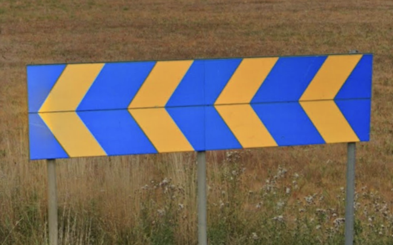
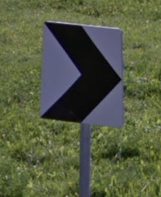

# Chevron

## Europe

 

### White on blue

Spain, France, Andorra (Spain only has 2 and 4 arrows)

 

### Yellow on blue

Sweden, Luxembourg

### Black on white

Serbia, Montenegro, North Macedonia, Slovenia

### White on black

Spain, Italy, Albania, Greece, Switzerland, United Kingdom, Malta

### Red on yellow

Austria, Croatia, Montenegro, San Marino

### White on red

Russia, Ukraine, Estonia, Austria, Hungary

### Yellow on black

Norway, Finland, Ireland, Portugal, Iceland, Luxembourg, Turkey (max W/E)

### Black on yellow

Gibraltar, Turkey (Ismir)

### With yellow frame: Romania

## Outside Europe

### Red on white

The Phillipines, Sri Lanka, South Africa, Argentina

### White on red

Quebec (Canada)

### White on black

Australia, Bangladesh

### Yellow on black

Brazil, Cambodia

