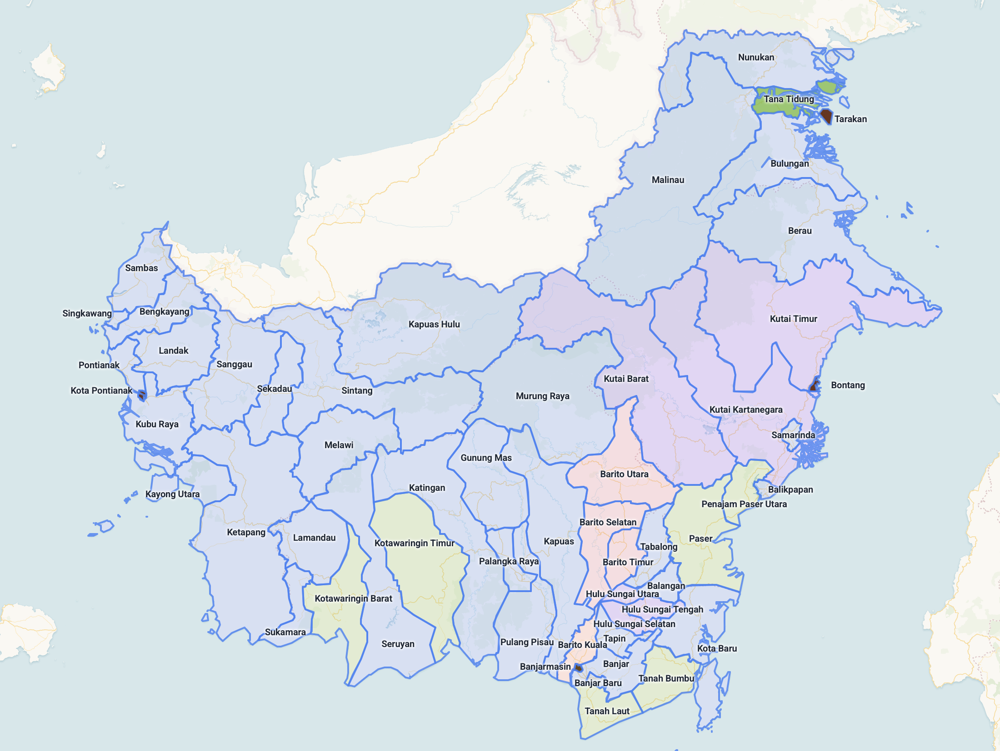
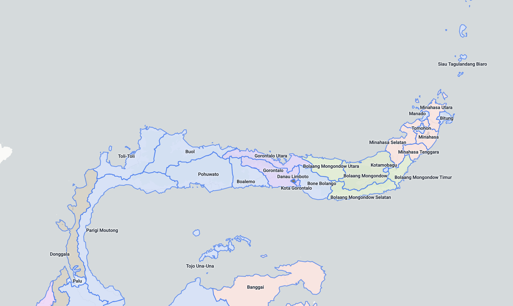
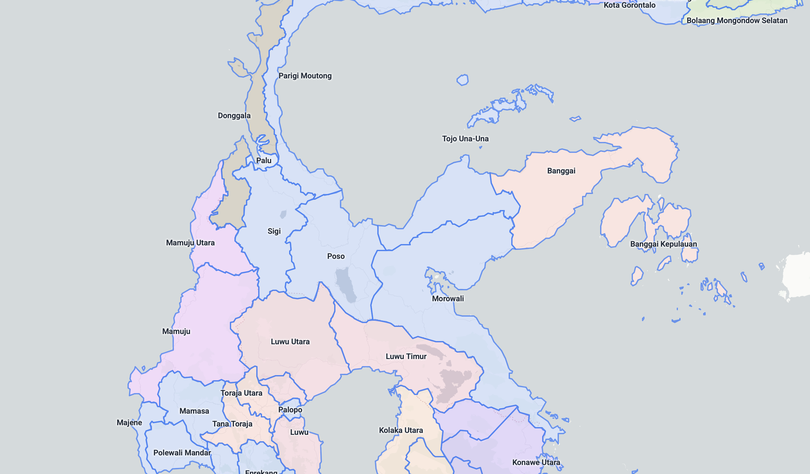
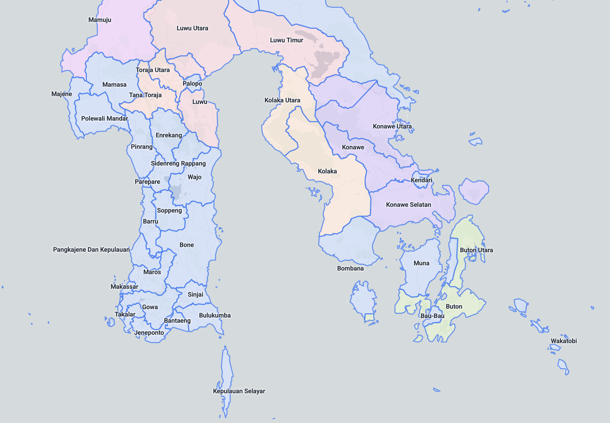

# Place name

You can use the website [Map Region Explorer](https://dingyiyi0226.github.io/map-region/) to check the place names in different countries.

## Indonesia

### Kalimantan

{}

{}

### Sulawesi

{}

{}

### Sumatra

{}

{}
- #### Aceh
  
- #### North Sumatra
  
{}
{}
- #### West Sumatra
  
- #### Riau
  
{}
{}
- #### Bengkulu
  
- #### Jambi
  
{}
{}
- #### South Sumatra
  
- #### Lampung
  
{}

{}

## Philippines

{}

{}

## Vietnam

{}

{}
