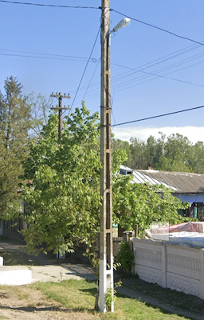

# Pole

## French Ladder Pole
France, Spain, Senegal

## Ladder Pole with tall step

{}

### Portugal

With see through holes

<--->

### Brazil

<--->

### Nigeria

{}

## Holey Pole: Hungary, Romania

{}

### Hungary

<--->

### Romania

Sometimes with white bottom

<--->

### Poland

Sometimes with A frame

{}

## Doubled up pole: Argentina, Bolivia

## Round concrete pole with holes on top

{}

### Cambodia

<--->

### Taiwan

{}
