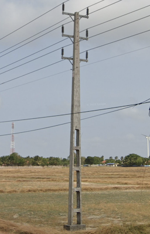

# Pole

## French Ladder Pole
France, Spain, Senegal

## Ladder Pole with tall step

{}

#### Portugal



<--->

#### Brazil

<--->

#### Nigeria

{}

## Holey Pole

{}

#### Hungary

<--->

#### Romania



<--->

#### Poland



{}

{}

#### Belgium



<--->

#### Sri Lanka

<--->

{}

## Square concrete: Belgium, Post-Soviet

## Square concrete with holes

{}

#### Thailand, Laos

<--->

#### Sri Lanka:



<--->

{}

## Doubled up pole: Argentina, Bolivia

## Round concrete pole with holes on top

{}

#### Cambodia

<--->

#### Taiwan

{}
