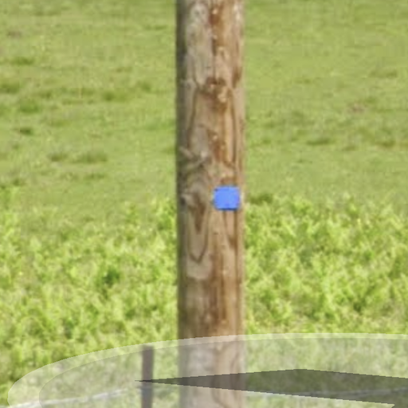
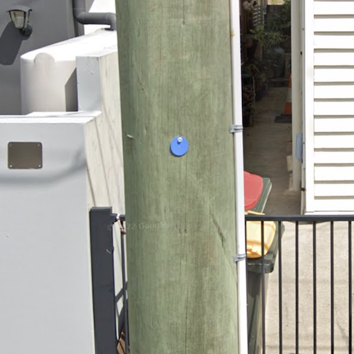
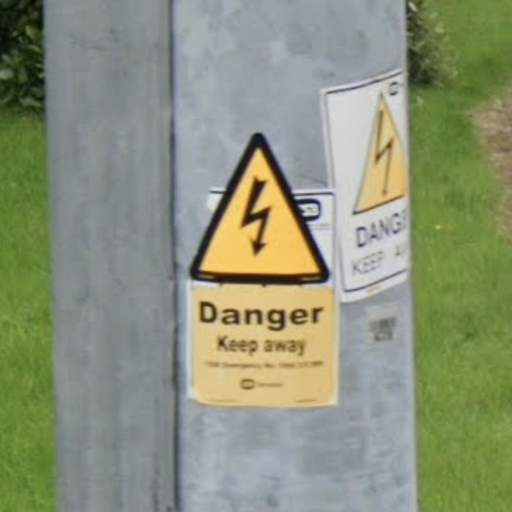

# Pole plate and pole paint

## Blue stickers

{}

#### France

<--->

#### Queensland, Australia

<--->

{}

## Warning

{}

#### United Kingdom



<--->

#### Ireland

<--->

{}

## Yellow black stripe

{}

#### Colombia



<--->

#### Northern Colombia



<--->

#### Peru



{}

## Yellow stripe

{}

#### California



<--->

#### Hawaii



<--->

{}
