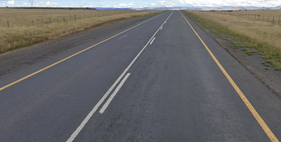
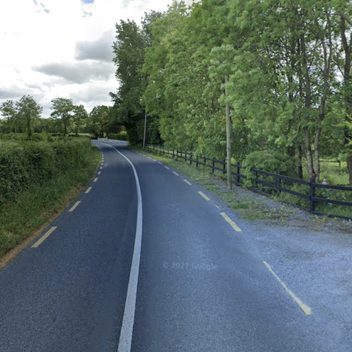
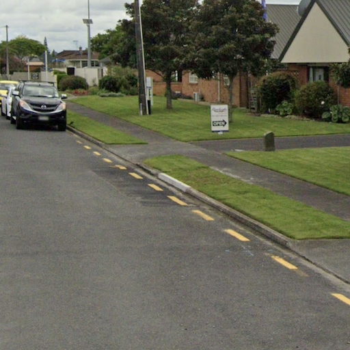
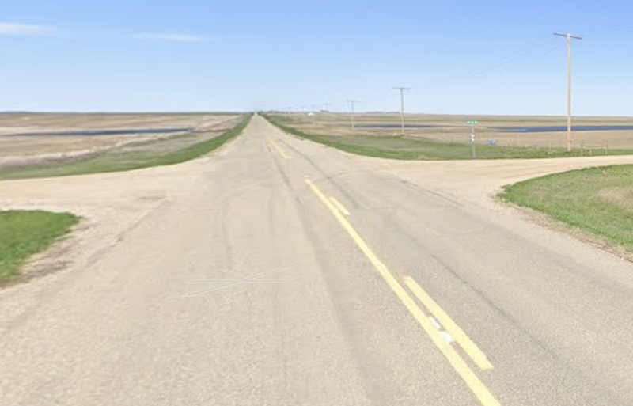
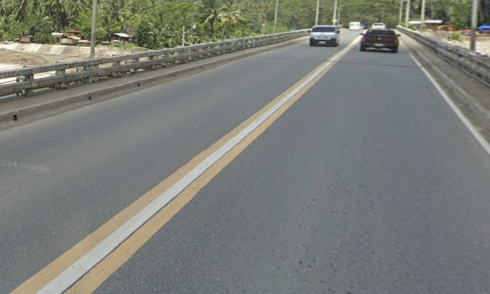

# Road markings

> [!NOTE]
> **Note**  
> Road lines are not reliable in urban areas.

> [!NOTE]
> **Note**  
> There are many exceptions and we only list the predominant patterns, so be aware of other clues.

## Outer yellow

South Africa, Botswana, Lesotho, Eswatini, Israel, Jordan, UAE, Oman

## Dashed outer yellow

{}

#### Ireland

<--->

#### New Zealand

<--->

{}

## America: mostly outer white center yellow

{}

#### Chile



<--->

#### National Parks in Chile



<--->

{}

### Saskatchewan, Canada

White dashes between yellow center line

### Middle yellow lines in North America

- **USA**: Always double yellow
- **Nova Scotia**: Always double yellow
- **New Brunswick**: More single yellow
- **Quebec**: More double yellow

## Triple center line

### Uruguay

### The Phillipines

### South Africa, Botswana, Eswatini, Lesotho

