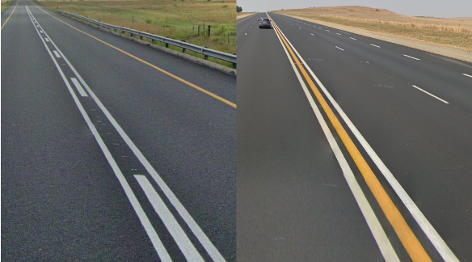

# Road Markings

{}
**Note**  
Road lines are not reliable in urban areas.
{}

{}
**Note**  
There are many exceptions and we only list the predominant patterns, so be aware of other clues.
{}

## Outer Yellow

South Africa, Botswana, Lesotho, Eswatini, Israel, Jordan, UAE, Oman

## Dashed outer yellow

{}

### Ireland

<--->

### New Zealand

<--->

{}

## America: Mostly outer white center yellow

{}

### Chile

All white

<--->

### National Parks in Chile

All yellow

<--->

{}

### Saskatchewan, Canada

White dashes between yellow center line

## Triple center line

### Uruguay

### The Phillipines

### South Africa, Botswana, Eswatini, Lesotho

