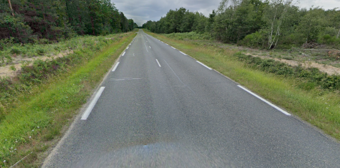
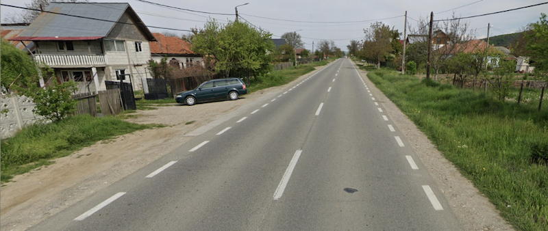
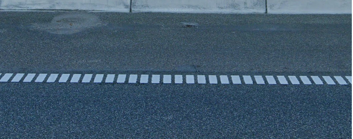
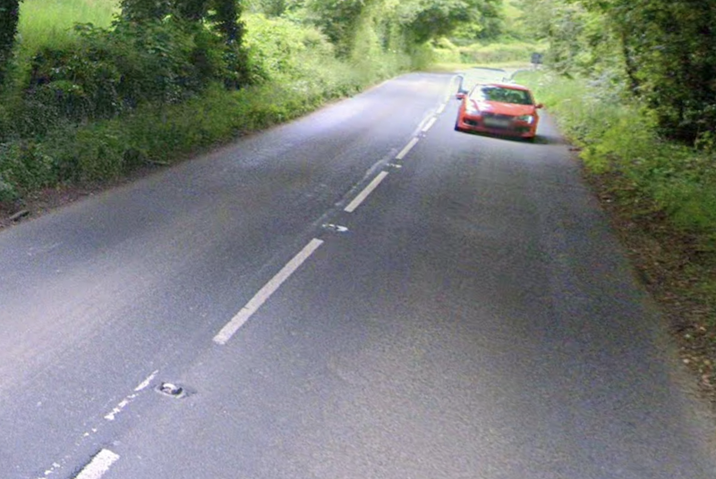
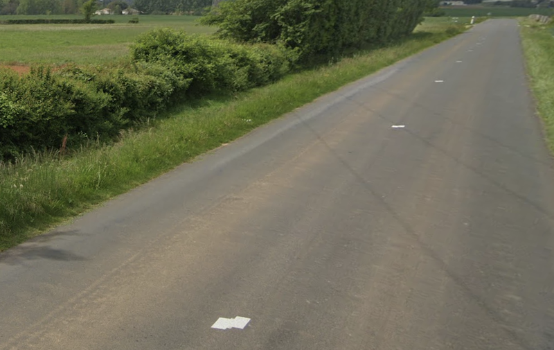
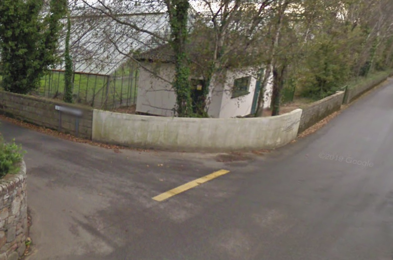

# Europe: Mostly all white

## Long outer dashes
Norway, France

## Short outer dashes
Sweden, Romania, Spain, Netherland

 

## Square outer dashes: Denmark

## Yellow single center line

{}

### Normay



<--->

### Finland



<--->

{}

## Long center dashes: France, UK

UK could have reflector between dashes

## Center block: France

## Yellow double center lines: Finland, Norway, Greece

## White double center lines:
Poland, Denmark, Greece

{}
**Note**  
Not so useful, double white line could be anywhere else
{}

## Yellow giveaway: Jersey Island

