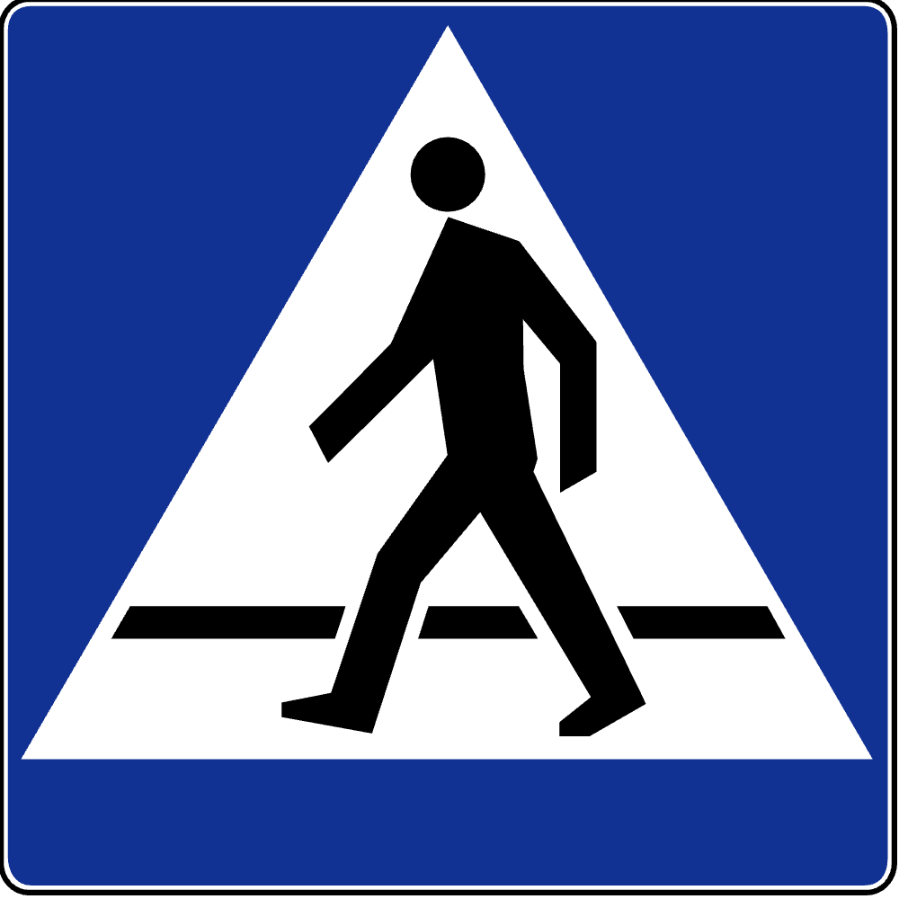
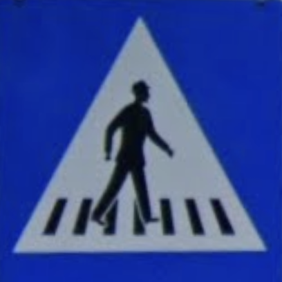
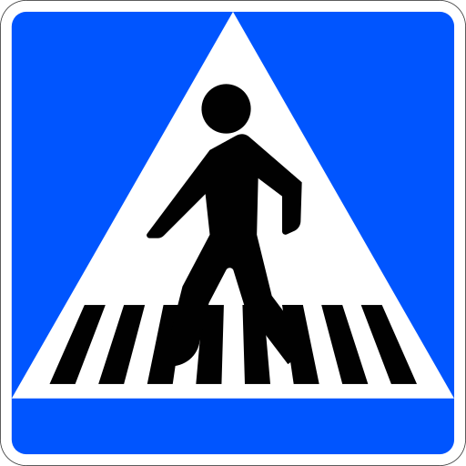
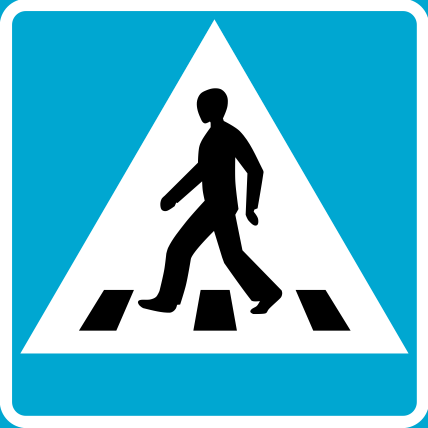
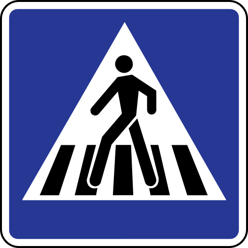
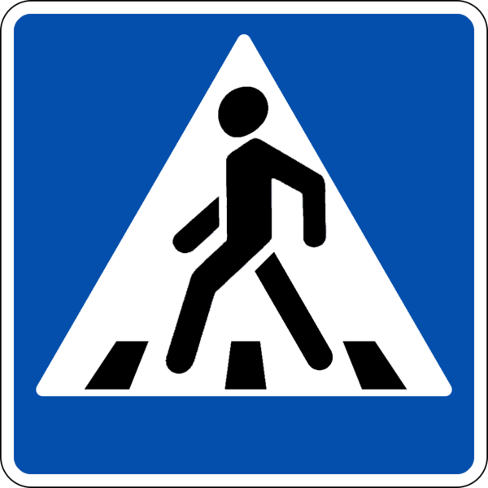
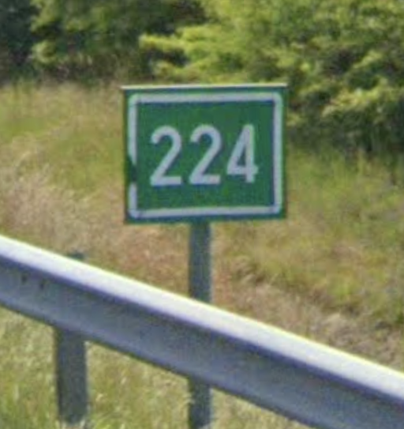

# Sign

## Pedestrian

### Unique Countries

{}

#### Poland

horizontal line

<--->

#### Switzerland

7 stripes

<--->

#### Spain

8 stripes

{}

### Baltic

{}

#### Estonia

<--->

#### Lativia

<--->

#### Lithuania

{}

### Nordic

### South Slavs

- Bulgaria: 4 stripes
- Others 🇸🇮🇭🇷🇲🇪🇷🇸🇲🇰: 5 stripes

### With Belt

Germany, Luxembourg, Hungary, Croatia, Montenegro, North Marcedonia, Portugal, Slovakia

### Yellow Background

Finland, Sweden, Iceland, Poland, North Marcedonia, Greece

## Yield

### Yellow Background

Finland, Sweden, Iceland,  Poland, North Marcedonia, Greece, Croatia, Slovenia

## Road Marker

### Baltic

### Hungary: Green marker

## Back of sign

### Black

Germany, Luxembourg, Italy, Albania, Romania

### Netherlands: With large border

## Stop

- ЗОГС: Mongolia
- Berhenti: Malaysia
- Dur: Turkey
- Arrêt: Quebec, Canada

## Misc

### Baltic

