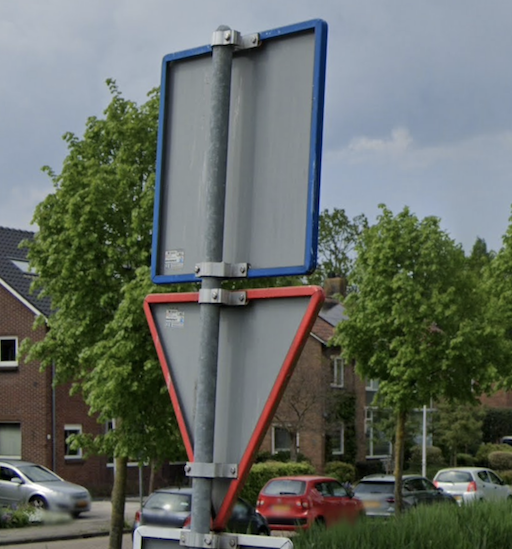

# Sign

## Hunting Sign

{}

#### Portugal



<--->

#### Spain



<--->

{}

## Back of sign

### Black

Germany, Luxembourg, Italy, Albania, Romania

### Netherlands: With large border

## Passing Place

{}

#### Norway



<--->

#### Sweden



<--->

{}

### Scotland (UK)



## Property Marker

{}

#### Western Australia



<--->

#### South Australia



<--->

{}
