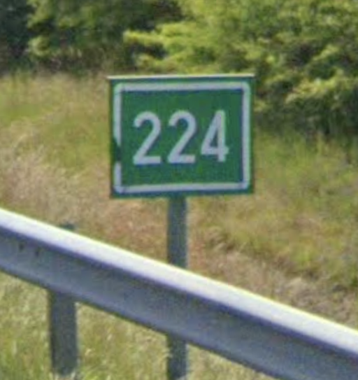

# Kilometer Marker

## Baltic

## Hungary: Green marker

## Way Stone

{}

### France



<--->

### Romania



<--->

### Portugal



{}

{}

### Senegal



<--->

### Tunisia



<--->

### Cambodia



{}

## South American Stone

{}

### Peru



<--->

### Colombia



<--->

### Uruguay



{}

## Black White Flag

{}

### Bolivia



<--->

### Argetina



<--->

{}

## American Style: Green Vertical

{}

### Colombia



<--->

### Puerto Rico



<--->

{}

### Canada

